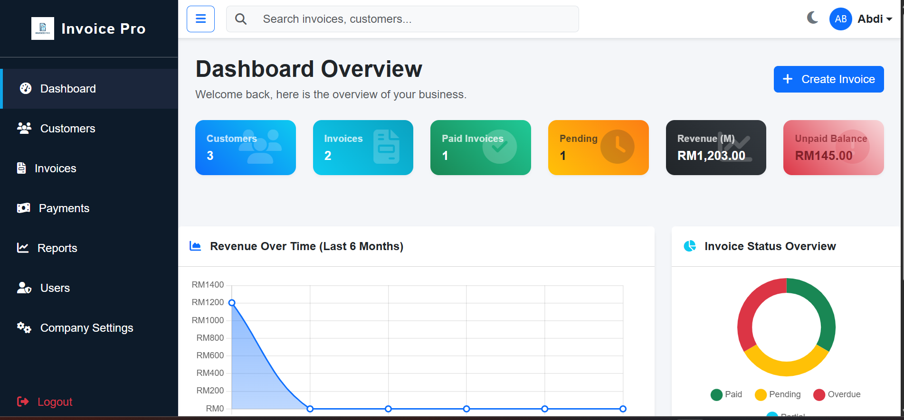

# Invoice Pro

Invoice Pro is a modern, responsive, and robust invoice management platform built with Laravel 12 (specifically Laravel v12.62.0). It allows businesses to efficiently manage their customers, invoices, and payments in one centralized platform.

## Features

- **Dashboard Overview**: Get a bird's eye view of your business with interactive charts and summaries.
- **Smart Search**: Quickly find customers and invoices via an AJAX-powered dropdown search feature.
- **AI-Powered Data Extraction**: Upload a PDF or image of an invoice, and let our Gemini AI integration automatically extract the relevant details for you.
- **Dark Mode Support**: Beautiful day/night theme toggling.
- **PDF Generation**: Easily export and print your invoices as PDFs.
- **Responsive UI**: Built with Bootstrap 5 for a flawless experience on both desktop and mobile.

## Showcase



## Requirements

- PHP >= 8.2
- Composer
- MySQL Database
- Gemini API Key (for AI extraction features)

## Installation

1. Clone the repository:
   ```bash
   git clone https://github.com/Abdiwahab23/Invoice_management.git
   ```
2. Navigate into the directory and install dependencies:
   ```bash
   cd Invoice_management
   composer install
   npm install && npm run build
   ```
3. Copy the `.env.example` to `.env` and configure your database and API keys:
   ```bash
   cp .env.example .env
   php artisan key:generate
   ```
4. Run migrations and seed the database (if seeders exist):
   ```bash
   php artisan migrate
   ```
5. Link storage for images/logos:
   ```bash
   php artisan storage:link
   ```
6. Start the local server:
   ```bash
   php artisan serve
   ```

## License

This project is open-source software.
